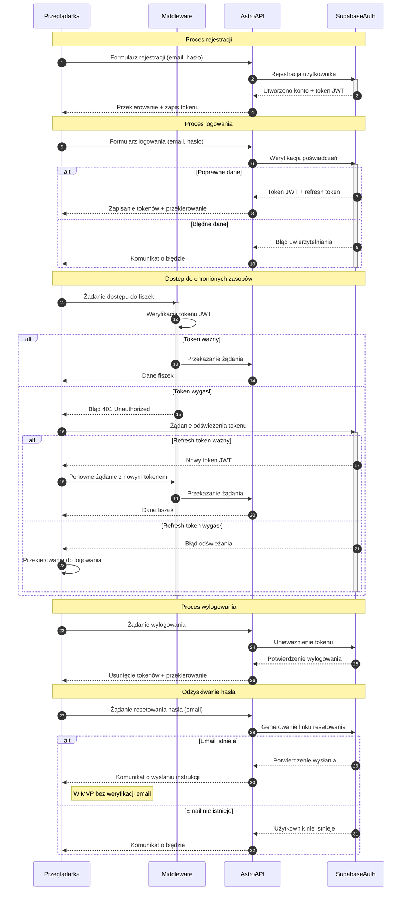

# Diagram procesu autentykacji dla 10x-cards

<authentication_analysis>
## Analiza procesów autentykacji

### Przepływy autentykacji
1. Rejestracja nowego użytkownika
2. Logowanie użytkownika
3. Automatyczne logowanie po rejestracji
4. Wylogowanie użytkownika
5. Odzyskiwanie hasła
6. Dostęp do chronionych zasobów (fiszki)
7. Wygaśnięcie sesji i odświeżenie tokenu

### Główni aktorzy
1. Przeglądarka (klient)
2. Middleware (weryfikacja tokenów i autoryzacja)
3. Astro API (logika biznesowa)
4. Supabase Auth (usługa uwierzytelniania)

### Procesy weryfikacji i odświeżania tokenów
1. Weryfikacja tokenu JWT przy każdym żądaniu do chronionych zasobów
2. Automatyczne odświeżanie tokenu przy wygaśnięciu
3. Przechowywanie tokenu w bezpieczny sposób po stronie klienta
4. Unieważnianie tokenu przy wylogowaniu

### Opis kroków autentykacji
1. **Rejestracja**: Użytkownik podaje email i hasło, system tworzy konto w Supabase Auth, użytkownik zostaje automatycznie zalogowany.
2. **Logowanie**: Użytkownik podaje dane logowania, Supabase Auth weryfikuje je i zwraca token JWT.
3. **Autoryzacja**: Token JWT jest przesyłany w nagłówku Authorization przy każdym żądaniu do API.
4. **Middleware**: Przed dostępem do chronionych zasobów Middleware weryfikuje token JWT.
5. **Odświeżanie**: Gdy token wygasa, system próbuje automatycznie odświeżyć go używając refresh tokenu.
6. **Wylogowanie**: Token zostaje unieważniony po stronie serwera i usunięty z lokalnego przechowywania.
</authentication_analysis>

<mermaid_diagram>

</mermaid_diagram> 