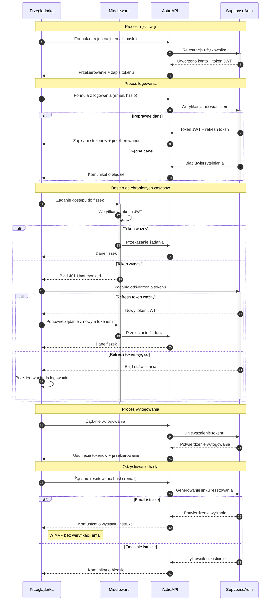

# Moduł autentykacji dla 10x-cards

## 1. Architektura i procesy autentykacji

### 1.1 Analiza procesów autentykacji

#### Główne przepływy autentykacji
1. Rejestracja nowego użytkownika
2. Logowanie użytkownika
3. Automatyczne logowanie po rejestracji
4. Wylogowanie użytkownika
5. Odzyskiwanie hasła
6. Dostęp do chronionych zasobów (fiszki)
7. Wygaśnięcie sesji i odświeżenie tokenu

#### Główni aktorzy
1. Przeglądarka (klient)
2. Middleware (weryfikacja tokenów i autoryzacja)
3. Astro API (logika biznesowa)
4. Supabase Auth (usługa uwierzytelniania)

#### Procesy weryfikacji i odświeżania tokenów
1. Weryfikacja tokenu JWT przy każdym żądaniu do chronionych zasobów
2. Automatyczne odświeżanie tokenu przy wygaśnięciu
3. Przechowywanie tokenu w bezpieczny sposób po stronie klienta
4. Unieważnianie tokenu przy wylogowaniu

### 1.2 Opis kroków autentykacji
1. **Rejestracja**: Użytkownik podaje email i hasło, system tworzy konto w Supabase Auth, użytkownik zostaje automatycznie zalogowany.
2. **Logowanie**: Użytkownik podaje dane logowania, Supabase Auth weryfikuje je i zwraca token JWT.
3. **Autoryzacja**: Token JWT jest przesyłany w nagłówku Authorization przy każdym żądaniu do API.
4. **Middleware**: Przed dostępem do chronionych zasobów Middleware weryfikuje token JWT.
5. **Odświeżanie**: Gdy token wygasa, system próbuje automatycznie odświeżyć go używając refresh tokenu.
6. **Wylogowanie**: Token zostaje unieważniony po stronie serwera i usunięty z lokalnego przechowywania.

### 1.3 Diagram sekwencji procesów autentykacji



## 2. Architektura interfejsu użytkownika dla autentykacji

### 2.1 Struktura stron i komponentów

#### Strony publiczne (dostępne dla niezalogowanych użytkowników):
- **`/` (strona główna)** - Zachęcająca strona z informacjami o aplikacji i przyciskami do logowania/rejestracji
- **`/auth/login`** - Strona z formularzem logowania
- **`/auth/register`** - Strona z formularzem rejestracji
- **`/auth/reset-password`** - Strona do żądania resetowania hasła
- **`/auth/update-password`** - Strona do ustawienia nowego hasła (dostępna po kliknięciu w link z emaila)

#### Komponenty React:
- **`AuthLayout.tsx`** - Layout dla stron autoryzacyjnych z logo i stylizacją
- **`LoginForm.tsx`** - Interaktywny formularz logowania
- **`RegisterForm.tsx`** - Interaktywny formularz rejestracji
- **`ResetPasswordForm.tsx`** - Formularz do żądania resetowania hasła
- **`UpdatePasswordForm.tsx`** - Formularz do ustawienia nowego hasła
- **`UserMenu.tsx`** - Komponent menu użytkownika z opcją wylogowania
- **`AuthGuard.tsx`** - Komponent wyższego rzędu do ochrony tras prywatnych

### 2.2 Przepływ interfejsu użytkownika

#### Rejestracja:
1. Użytkownik wchodzi na stronę `/auth/register`
2. Formularz `RegisterForm.tsx` zawiera pola:
   - Adres email (walidacja formatu email)
   - Hasło (minimum 8 znaków, co najmniej 1 wielka litera, 1 cyfra, 1 znak specjalny)
   - Potwierdzenie hasła (zgodność z polem hasła)
3. Po poprawnym wypełnieniu formularza i kliknięciu "Zarejestruj się", komponent wywołuje API Supabase Auth
4. W przypadku sukcesu użytkownik jest automatycznie zalogowany i przekierowany do `/dashboard`

#### Logowanie:
1. Użytkownik wchodzi na stronę `/auth/login`
2. Formularz `LoginForm.tsx` zawiera pola:
   - Adres email
   - Hasło
   - Link "Zapomniałem hasła" kierujący do `/auth/reset-password`
3. Po poprawnym wypełnieniu formularza, komponent wywołuje API Supabase Auth
4. W przypadku sukcesu użytkownik jest przekierowany do `/dashboard`

#### Wylogowanie:
1. Zalogowany użytkownik klika przycisk "Wyloguj" w komponencie `UserMenu.tsx`
2. Komponent wywołuje odpowiedni endpoint Supabase Auth
3. Po wylogowaniu następuje przekierowanie na stronę główną `/`

### 2.3 Walidacja i obsługa błędów

#### Walidacja formularzy:
- Wykorzystanie biblioteki `zod` do walidacji danych
- Schematy walidacyjne dla logowania i rejestracji
- Komunikaty błędów w języku polskim, wyświetlane pod odpowiednimi polami

#### Obsługa błędów API:
- Mapowanie kodów błędów Supabase na przyjazne komunikaty
- Wyświetlanie powiadomień o błędach w formie toastów lub komunikatów inline
- Zabezpieczenia przed atakami brute force (opóźnienie, ograniczenia prób)

## 3. Implementacja API autentykacji

### 3.1 Struktura endpointów API

#### Endpointy Supabase Auth:
- **`POST /auth/v1/signup`** - Rejestracja nowego użytkownika
- **`POST /auth/v1/token?grant_type=password`** - Logowanie użytkownika
- **`POST /auth/v1/logout`** - Wylogowanie użytkownika
- **`POST /auth/v1/recover`** - Żądanie resetowania hasła
- **`PUT /auth/v1/user`** - Aktualizacja danych użytkownika (w tym zmiana hasła)

#### Endpointy Astro API (wrappery dla Supabase):
- **`POST /api/auth/register`** - Rejestracja
- **`POST /api/auth/login`** - Logowanie
- **`POST /api/auth/logout`** - Wylogowanie
- **`POST /api/auth/reset-password`** - Żądanie resetowania hasła
- **`POST /api/auth/update-password`** - Aktualizacja hasła
- **`GET /api/auth/session`** - Pobranie aktualnej sesji

### 3.2 Szczegóły żądań i odpowiedzi

#### Rejestracja użytkownika
- Metoda: POST
- Ścieżka: /api/auth/register
- Request Body:
  ```json
  {
    "email": "string",
    "password": "string"
  }
  ```
- Sukces (201 Created):
  ```json
  {
    "id": "uuid",
    "email": "string",
    "created_at": "timestamp"
  }
  ```
- Błędy:
  - 400 Bad Request (Nieprawidłowe dane)
  - 409 Conflict (Email już istnieje)

#### Logowanie użytkownika
- Metoda: POST
- Ścieżka: /api/auth/login
- Request Body:
  ```json
  {
    "email": "string",
    "password": "string"
  }
  ```
- Sukces (200 OK):
  ```json
  {
    "token": "string",
    "user": {
      "id": "uuid",
      "email": "string"
    }
  }
  ```
- Błędy:
  - 400 Bad Request (Nieprawidłowe dane)
  - 401 Unauthorized (Nieprawidłowe poświadczenia)

### 3.3 Bezpieczeństwo i uwagi implementacyjne

- Hasła są haszowane przed zapisaniem w bazie danych (bcrypt)
- Tokeny JWT mają czas wygaśnięcia 24 godziny
- W MVP nie będzie implementowana weryfikacja adresów email
- Zaplanowane są zabezpieczenia przed atakami brute force
- Tokeny są przechowywane bezpiecznie po stronie klienta (localStorage/cookies)

## 4. Middleware i zarządzanie sesją

### 4.1 Middleware Astro

```typescript
// src/middleware.ts
import { defineMiddleware } from 'astro:middleware';
import { supabase } from './lib/supabase';

export const onRequest = defineMiddleware(async ({ request, locals, redirect }, next) => {
  // Pobieranie i ustawienie sesji użytkownika
  const { data: { session } } = await supabase.auth.getSession();
  locals.session = session;
  locals.user = session?.user || null;
  
  // Sprawdzanie autoryzacji dla chronionych ścieżek
  const url = new URL(request.url);
  const isAuthRoute = url.pathname.startsWith('/auth/');
  const isApiRoute = url.pathname.startsWith('/api/');
  const isPublicRoute = url.pathname === '/' || isAuthRoute || isApiRoute;
  
  if (!isPublicRoute && !session) {
    return redirect('/auth/login');
  }
  
  if (isAuthRoute && session && !url.pathname.includes('logout')) {
    return redirect('/dashboard');
  }
  
  return next();
});
```

### 4.2 Hook do zarządzania sesją

```typescript
// src/hooks/useAuth.ts
import { useState, useEffect } from 'react';
import { supabase } from '../lib/supabase';

export function useAuth() {
  const [user, setUser] = useState(null);
  const [loading, setLoading] = useState(true);
  
  useEffect(() => {
    // Pobierz aktualną sesję
    const fetchSession = async () => {
      setLoading(true);
      try {
        const { data: { user } } = await supabase.auth.getUser();
        setUser(user);
      } finally {
        setLoading(false);
      }
    };
    
    fetchSession();
    
    // Nasłuchuj zmian sesji
    const { data: { subscription } } = supabase.auth.onAuthStateChange(
      (event, session) => {
        setUser(session?.user || null);
      }
    );
    
    return () => {
      subscription.unsubscribe();
    };
  }, []);
  
  return { user, loading };
}
```

## 5. Uwagi dla implementacji MVP

- Weryfikacja email nie będzie implementowana w MVP
- Uproszczony mechanizm refresh tokenu w wersji początkowej
- Limity prób logowania mogą być pominięte w pierwszej wersji
- W MVP wdrożyć podstawowe mechanizmy bezpieczeństwa, pełną implementację zaplanować w kolejnych iteracjach 