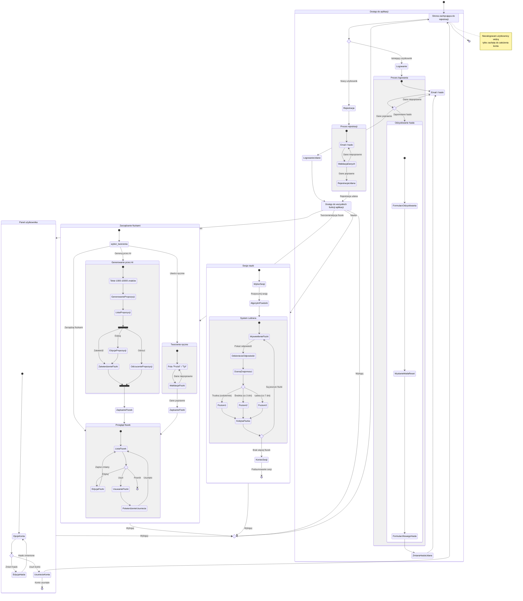

# Diagram podróży użytkownika dla 10x-cards

## 1. Analiza podróży użytkownika

### 1.1 Główne ścieżki użytkownika

- **Dostęp do aplikacji** - Rejestracja (US-001), logowanie (US-002), odzyskiwanie hasła
- **Zarządzanie fiszkami** - Generowanie z AI (US-003), przegląd i zatwierdzanie (US-004), edycja (US-005), usuwanie (US-006), ręczne tworzenie (US-007)
- **Nauka** - Sesje nauki z algorytmem powtórek (US-008)
- **Zarządzanie kontem** - Edycja profilu, zmiana hasła, wylogowanie

### 1.2 Szczegółowy opis ścieżek

1. **Rejestracja konta** (US-001)

   - Użytkownik wypełnia formularz rejestracyjny (email, hasło)
   - System tworzy konto i loguje użytkownika
   - Przekierowanie do panelu głównego

2. **Logowanie do aplikacji** (US-002)

   - Użytkownik wprowadza dane logowania
   - System uwierzytelnia użytkownika
   - Przekierowanie do panelu głównego

3. **Odzyskiwanie hasła**

   - Użytkownik podaje adres email
   - System generuje link resetujący
   - Użytkownik ustawia nowe hasło

4. **Generowanie fiszek przy użyciu AI** (US-003)

   - Użytkownik wprowadza tekst źródłowy (1000-10000 znaków)
   - System przetwarza tekst i generuje propozycje fiszek
   - Wyświetlenie listy wygenerowanych fiszek

5. **Przegląd i zatwierdzanie propozycji fiszek** (US-004)

   - Użytkownik przegląda wygenerowane fiszki
   - Może zatwierdzić, edytować lub odrzucić każdą fiszkę
   - Zatwierdzone fiszki są zapisywane do bazy

6. **Edycja fiszek** (US-005)

   - Użytkownik wybiera fiszkę do edycji
   - Modyfikuje zawartość przodu i/lub tyłu
   - Zapisuje zmiany

7. **Usuwanie fiszek** (US-006)

   - Użytkownik wybiera fiszkę do usunięcia
   - Potwierdza operację
   - System usuwa fiszkę

8. **Ręczne tworzenie fiszek** (US-007)

   - Użytkownik wypełnia formularz nowej fiszki
   - System weryfikuje poprawność danych
   - Fiszka zostaje dodana do kolekcji użytkownika

9. **Sesja nauki z algorytmem powtórek** (US-008)

   - Użytkownik rozpoczyna sesję nauki
   - System wybiera fiszki według algorytmu Leitnera
   - Użytkownik ocenia swoją znajomość każdej fiszki
   - System aktualizuje poziom fiszki w algorytmie powtórek

10. **Wylogowanie**
    - Użytkownik klika przycisk wylogowania
    - System kończy sesję
    - Przekierowanie na stronę główną dla niezalogowanych

### 1.3 Punkty decyzyjne i alternatywne ścieżki

- **Rejestracja/Logowanie**: Użytkownik wybiera rejestrację lub logowanie
- **Odzyskiwanie hasła**: Alternatywna ścieżka podczas logowania
- **Tworzenie fiszek**: Wybór między generowaniem AI a tworzeniem ręcznym
- **Przegląd wygenerowanych fiszek**: Zatwierdzenie, edycja lub odrzucenie każdej fiszki
- **Sesja nauki**: Ocena znajomości fiszki (przeniesienie do innego poziomu)

### 1.4 Cele poszczególnych stanów

- **Strona Główna (niezalogowany)**: Zachęcenie użytkownika do rejestracji
- **Rejestracja**: Utworzenie nowego konta użytkownika
- **Logowanie**: Uwierzytelnienie istniejącego użytkownika
- **Strona Główna (zalogowany)**: Centralny punkt dostępu do funkcji aplikacji
- **Generowanie fiszek AI**: Automatyczne tworzenie zestawu fiszek
- **Tworzenie ręczne**: Dodawanie własnych fiszek
- **Przegląd fiszek**: Zarządzanie istniejącymi fiszkami
- **Sesja nauki**: Efektywne przyswajanie wiedzy z wykorzystaniem algorytmu powtórek

## 2. Diagram stanu podróży użytkownika

