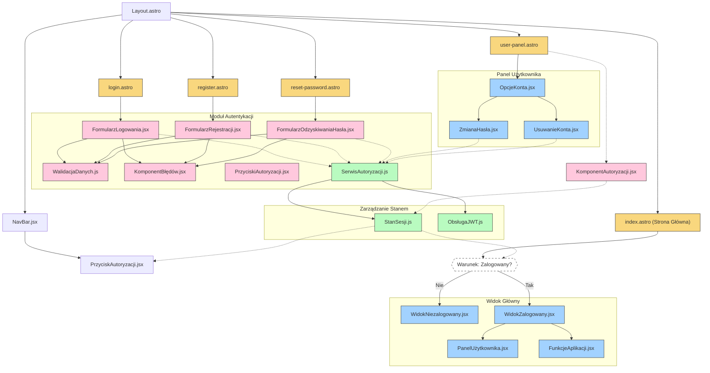

# Architektura interfejsu użytkownika dla 10x-cards

## 1. Analiza architektury UI

### 1.1 Komponenty dla modułu logowania i rejestracji

- Formularz rejestracyjny (pola: adres e-mail, hasło)
- Formularz logowania (pola: adres e-mail, hasło)
- Mechanizm odzyskiwania hasła
- Komponent powiadomień (potwierdzenia, błędy)
- Panel użytkownika z opcjami zarządzania kontem
- Widok główny dla niezalogowanych użytkowników
- Widok główny dla zalogowanych użytkowników
- Layout aplikacji z przyciskiem logowania/wylogowania

### 1.2 Główne strony i ich komponenty

- **Strona główna (niezalogowani użytkownicy)**:

  - Layout.astro z przyciskiem logowania
  - Komponent zachęcający do rejestracji

- **Strona główna (zalogowani użytkownicy)**:

  - Layout.astro z przyciskiem wylogowania
  - Panel dostępu do funkcji aplikacji (generowanie/zarządzanie fiszkami, sesje nauki)

- **Strona logowania**:

  - FormularzLogowania.jsx
  - KomponentBłędów.jsx
  - LinkOdzyskiwanieHasła.jsx

- **Strona rejestracji**:

  - FormularzRejestracji.jsx
  - KomponentBłędów.jsx

- **Strona odzyskiwania hasła**:

  - FormularzOdzyskiwaniaHasła.jsx
  - KomponentBłędów.jsx

- **Panel użytkownika**:
  - OpcjeKonta.jsx (edycja hasła, usunięcie konta)

### 1.3 Przepływ danych między komponentami

- Formularze logowania/rejestracji -> walidacja danych po stronie klienta -> żądania API -> aktualizacja stanu sesji
- Stan sesji użytkownika wpływa na routing i dostępne opcje UI
- Mechanizm autoryzacji przekazuje tokeny JWT do zabezpieczonych endpointów
- Panel użytkownika pobiera i aktualizuje dane konta przez API

### 1.4 Funkcjonalność komponentów

- **Layout.astro**: Główny layout aplikacji, zawiera nagłówek z przyciskami logowania/wylogowania
- **FormularzLogowania.jsx**: Odpowiedzialny za uwierzytelnianie użytkownika, walidację pól i komunikację z API
- **FormularzRejestracji.jsx**: Obsługuje proces tworzenia nowego konta, walidację pól i komunikację z API
- **FormularzOdzyskiwaniaHasła.jsx**: Umożliwia zresetowanie hasła, walidację adresu e-mail i komunikację z API
- **KomponentBłędów.jsx**: Wyświetla komunikaty o błędach formularzy i odpowiedzi z API
- **OpcjeKonta.jsx**: Pozwala na zarządzanie kontem użytkownika
- **StanSesji.js**: Zarządza stanem logowania użytkownika w aplikacji
- **KomponentAutoryzacji.jsx**: HOC (Higher Order Component) zapewniający dostęp tylko dla zalogowanych użytkowników

## 2. Diagram przepływu interfejsu użytkownika

## 3. Moduły funkcjonalne interfejsu

### 3.1 Moduł autentykacji

- **Cele**: Zarządzanie dostępem, autoryzacja, bezpieczne przechowywanie danych użytkownika
- **Główne komponenty**: Formularze logowania/rejestracji, obsługa resetowania hasła, zarządzanie tokenami JWT
- **Integracja**: Supabase Auth, middleware Astro

### 3.2 Moduł zarządzania fiszkami

- **Cele**: Tworzenie, edycja, usuwanie fiszek, obsługa generowania przez AI
- **Główne komponenty**: FormularzFiszki, ListaFiszek, KomponentGenerowaniaAI
- **Integracja**: API fiszek, zewnętrzne API AI

### 3.3 Moduł nauki

- **Cele**: Sesje nauki z wykorzystaniem algorytmu Leitnera, śledzenie postępów
- **Główne komponenty**: WidokFiszki, PrzycizkiOceny, PostępSesji, PodsumowanieSesji
- **Integracja**: API systemu Leitnera, przechowywanie historii nauki

### 3.4 Moduł interfejsu administracyjnego

- **Cele**: Zarządzanie kontem, ustawienia użytkownika
- **Główne komponenty**: OpcjeKonta, ZmianaHasła, UsuwanieKonta
- **Integracja**: API zarządzania kontem

## 4. Responsywność i dostępność

### 4.1 Zasady projektowania responsywnego

- Podejście Mobile-First - projektowanie zaczynające się od najmniejszych ekranów
- Wykorzystanie Tailwind CSS do responsywnych layoutów
- Breakpointy: 640px (sm), 768px (md), 1024px (lg), 1280px (xl)
- Dostosowywanie układu do różnych rozmiarów ekranu przez modyfikacje siatki i wielkości komponentów

### 4.2 Zasady dostępności (WCAG)

- Odpowiedni kontrast kolorów (minimum AA)
- Obsługa klawiaturą wszystkich funkcji
- Poprawna struktura nagłówków
- Alternatywne opisy dla elementów graficznych
- Poprawna semantyka HTML
- Komunikaty błędów dostępne dla czytników ekranu
- Testowanie z pomocą narzędzi takich jak Lighthouse i axe-core
